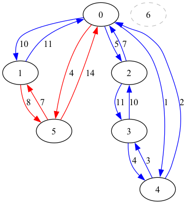

# Описание условий задачи

Создать программу для работы с графовыми структурами: ввод, вывод в графической форме, 
поиск кратчайшего пути

Заданы две системы двухсторонних дорог с одним и тем же множеством городов (железные и шоссейные дороги).
Найти минимальный по длине путь из города A в город B, который может проходить как по железной так и по
шоссейной дорогам, и места пересадок с одного вида транспорта на другой на этом пути.


# Описание ТЗ

## Описание входных данных

На вход программе подается введеный граф, для которого нужно ввести:

- количество вершин - целочисленная переменная, должна быть больше нуля
- количество железных и шоссейных дорог -  целочисленная переменная, должна быть больше нуля но меньше
(количество вершин ^ 2) / 2
- дорога - для каждой вершины и для каждого типа дорог отдельно вводятся три числа: индекс конечной вершины,длина  дороги туда,длина дороги обратно, числа заданы целочисленными переменными в формате int, индекс конечной вершины должен быть больше нуля, меньше общего количества вершин, и не быть равным индексу текущей вершины. Длины дорог должна быть больше нуля и дорога на момент добавления не должна существовать

При вводе индексов вершин для поиска дорог между ними, индексы вершин должны быть больше нуля и принадлежать множеству вершин,даже если к ним не подведена ни одна дорога

## Описание результирующих данных

Пользователю выдается сообщение об успехе/ошибке при выполнения требуемого действия:

- Вывод конечного пути: Выводятся найденная длина пути, путь в виде числовой последовательности вершин 
и индексы вершин,где произошла пересада

- Вывод в графической форме: выводится в файл show.dot в языке описания графов DOT, шоссейные дороги помечаются красным, железнодорожные пути - синим

- Вывод в текстовой форме: выводится в консоль дороги в формате : 
исходная_вершина -> конечная_вершина: длина пути

## Описание задачи,реализуемой в программе 

Обработка графовой структуры в соответствии с указанным вариантом задания. Обосновать выбор необходимого алгоритма и выбор структуры для представления графов. Предложить вариант реальной задачи, для решения которой можно использовать разработанную программу.Результат выдать в графической форме.

## Описание способов обращения к программе

Способ обращения к программе пользователем происходит через исполняемый файл app.exe.

## Описание аварийных ситуаций

- ERROR_MALLOC - ошибка выделения динамической памяти, программа не смогла выделить динамическую память на матрицу смежности
- ERROR_SIZE_INPUT- ошибка введеного размера, программа не смогла считать количество вершин и дорог
- ERROR_UNINIT- ошибка неинициализированного графа, программа пытается вевести или найти кратчайший путь для неинициализированного графа
- ERROR_NODE_INPUT- ошибка введеного пути, программа не смогла считать параметры, необходимые для заданного пути
- ERROR_SIZE_VALUE - ошибка значения размера, введеный размер не соответствует требуемому формату
- ERROR_NODE_VALUE - ошибка значения пути, введеный путь не соответствует требуемому формату
- Другие ошибки и исключительные ситуации, связанные с операционной системой или другими программами


# Описание внутренних СД

Граф в задаче хранится в формате матрицы смежности. Этот способ хранения матрицы был выбран из-за простоты поиска пути между двумя вершинами и быстродействия обращения к ним. Однако недостаток этого способа заключается в том, что приходится выделять память на хранение несуществующих путей, что делает данный способ хранения неэффективным в случае, если в графе большая часть путей не существует.

В программме для графа используется структурный тип данных graph_t: 

```c 
typedef struct {
    int** railroad_matrix;  
    int** highway_matrix; 
    int vertices;          
} graph_t;
```
- int** railroad_matrix - матрица смежности для железнодорожных путей, на позиции  railroad_matrix[i][j] хранится длина железнодорожного пути из вершины i в вершину j, длина пути хранится в формате целочисленной переменной int
- int** highway_matrix - матрица смежности для шоссейных путей, на позиции  highway_matrix[i][j] хранится длина шоссейного пути из вершины i в вершину j, длина пути хранится в формате целочисленной переменной int
- int vertices - количество вершин, хранится в формате целочисленной переменной int

Для хранения итогового пути используется структура 
dist_t

```c 
typedef struct {
    int distance;
    int prev;
    int type;
} dist_t;
```
- int distance - длина пути, пройденного до этой вершины, хранится в формате целочисленной переменной int
- int prev - индекс предыдущей вершины, для начальной вершины помечается -1, хранится в формате целочисленной переменной int
- int type - тип пути, пройденного до этой вершины, хранится в формате целочисленной переменной int

# Описание алгоритмов

## Общий алгоритм данных

1. Начинается выполнение программы в функции main. Пользователю предлагается выбрать дальнейшее действие:
- 1  - Инициализировать граф 
- 2  - Вывести граф в файл 
- 3  - Вывести граф в консоль
- 4  - Найти кратчайшее расстояние
- 5 - Вывод доступных опций 
- 0 - Завершение работы..... 

В случаем ошибки ввода опции, пользователю предложится ввести опцию заново. 
При выборе опции "0" программа завершает свою работу


### Поиск кратчайшего расстояния алгоритм Дейстры

- На вход подается указатель на граф в формате graph_t, индекс начальной вершины и указатель на массив путей dist_t
- Для каждой вершины задается начальная длина пути между ней и начальной или INF, если между ней и начальной вершиной нет прямого пути 
- В основном цикле алгоритма находится не посещенная вершина с минимальным расстоянием, затем проверяются все соседние с этой вершины, определяется какой путь(железнодорожный или шоссе) следует использовать для соединения с учетом весов и , если эта дорога кратчайшая, обновляет кратчайшее расстояние, предыдущая вершина и тип пути


# Тестирование

Для тестирования используется следующий граф:



## Положительные тесты

|         Описание тестов          |                           Ожидаемый результат                           |
| :------------------------------: | :---------------------------------------------------------------------: |
|     Корректный ввод вершины      |                          Инициализация успешна                          |
|  Вывод дерева в матричной форме  |                  Вывод дорог между вершинами построчно                  |
| Вывод дерева в графической форме |                     Вывод узла в файл show.dot.dot                      |
| Поиск пути между вершинами 0 и 1 |           Длина пути из пункта 0 в пункт 1 равен 10 Путь: 0 1           |
| Поиск пути между вершинами 0 и 5 |           Длина пути из пункта 0 в пункт 5 равен 4 Путь: 0 5            |
| Поиск пути между вершинами 0 и 4 |           Длина пути из пункта 0 в пункт 4 равен 1 Путь: 0 4            |
| Поиск пути между вершинами 4 и 5 | Длина пути из пункта 4 в пункт 5 равен 6 Путь: 4 0 5 Места пересадок: 0 |
| Поиск пути между вершинами 1 и 3 |         Длина пути из пункта 1 в пункт 3 равен 15 Путь: 1 0 4 3         |
| Поиск пути между вершинами 0 и 6 |                                Нет пути                                 |


## Негативные тесты
|                       Описание тестов                        | Ожидаемый код ошибки |
| :----------------------------------------------------------: | :------------------: |
|              Вывод неинициализированного графа               |     ERROR_UNINIT     |
|          Поиск вершин в неинициализированном графе           |     ERROR_UNINIT     |
|    Ввод отрицательного количества вершин при вводе графа     |   ERROR_SIZE_INPUT   |
| Ввод количества путей превышающее допустимое при вводе графа |   ERROR_SIZE_VALUE   |
|               Ввод ребра с отрицательным весом               |   ERROR_NODE_VALUE   |
|          Ввод ребра между несуществующими вершинами          |   ERROR_NODE_VALUE   |
|                          Ввод цикла                          |   ERROR_NODE_VALUE   |
|           Вместто количества вершин введена буква            |   ERROR_SIZE_INPUT   |


# Вывод

Использование графов  и алгоритмов работы с ними при поиске кратчайшего расстояния между двумя пунктами, учитывая возможную необходимость пересадок, помогла облегчить процесс поиска. В выбранной задаче был использован алгоритм Дейстры для поиска кратчайшего расстояния между двумя вершинами, так как по условию расстояние между двумя пунктами не может быть отрицательными, при этом сам алгоритм обладает простотой реализации и эффективностью.
Подобную программу можно использовать при сооздании навигаторов, в которых вершинами графа будут являться перекрестки/пересадки на жд дороги, что позволит достичь временной эффективности при хранении графа в виде матрицы смежности

# Ответ на контрольные вопросы

1.Что такое граф?

Граф – это конечное множество вершин и ребер, соединяющих их, т. е.:
G = < V,E >,
где V – конечное непустое множество вершин; Е – множество ребер (пар
вершин).

2.Как представляются графы в памяти?

Графы могут быть представлены различными способами в памяти
компьютера. Некоторые из распространенных представлений включают
матрицы смежности и списки смежности. 

В матрице смежности
используется двумерный массив для хранения информации о связях между
вершинами.В этой матрице элемент b[i,j]=1, если ребро, связывающее вершины Vi и Vj существует и b[i,j]=0, если ребра
нет. У неориентированных графов матрица смежности всегда симметрична.

Список смежностей содержит для каждой вершинысписок тех вершин, которые непосредственно связаны с этой вершиной.
Каждый элемент списка смежностей является записью, содержащей данную
вершину и указатель на следующую запись в списке (для последней записи в списке
этот указатель – пустой). Входы в списки смежностей для каждой вершины графа
хранятся в таблице (массиве)

3.Какие операции возможны над графами?

Операции над графами включают добавление и удаление вершин и ребер,
проверку наличия ребра между двумя вершинами, нахождение соседей
вершины, обход графа,поиск кратчайшего пути от одной вершины к другой (если он есть),поиск кратчайшего пути от одной вершины ко всем другим, поиск кратчайших путей между всеми вершинами, поиск эйлерова пути (если он есть), поиск гамильтонова пути (если он есть).

4.Какие способы обхода графов существуют?

Обходы графов могут быть в глубину (DFS - Depth-First Search) и в
ширину (BFS - Breadth-First Search). DFS исследует как можно глубже в
структуру графа, прежде чем возвращаться, в то время как BFS идет по
уровням, исследуя вершины на текущем уровне перед переходом к
следующему.

5.Где используются графовые структуры?

Графовые структуры широко используются в различных областях, таких
как информатика, транспортное планирование, социальные сети,
биоинформатика, графовые базы данных, анализ сетей и др.

6.Какие пути в графе Вы знаете?

В графе могут существовать различные типы путей, включая простой путь (без повторяющихся вершин), цикл (замкнутый путь), кратчайший путь (с минимальной суммой весов рѐбер) , эйлеров путь(Произвольный путь в графе, проходящий через каждое ребро графа точно один раз), гамильтонов путь(Путь в графе, проходящий в точности один раз через каждую вершину графа )

7.Что такое каркасы графа?

Каркас графа - это подграф, который включает в себя все вершины и некоторое подмножество рѐбер исходного графа, образующее дерево и не имеющий циклов. Каркасы часто используются в алгоритмах поиска минимального остовного
дерева, где стремятся найти подграф с минимальной суммой весов рѐбер,
охватывающий все вершины исходного графа.